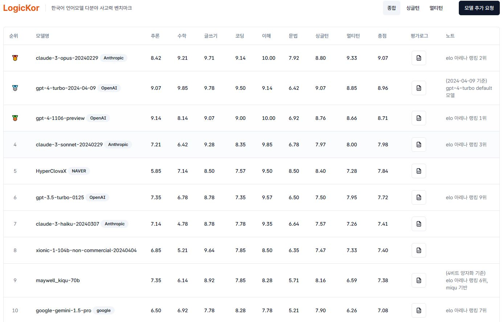
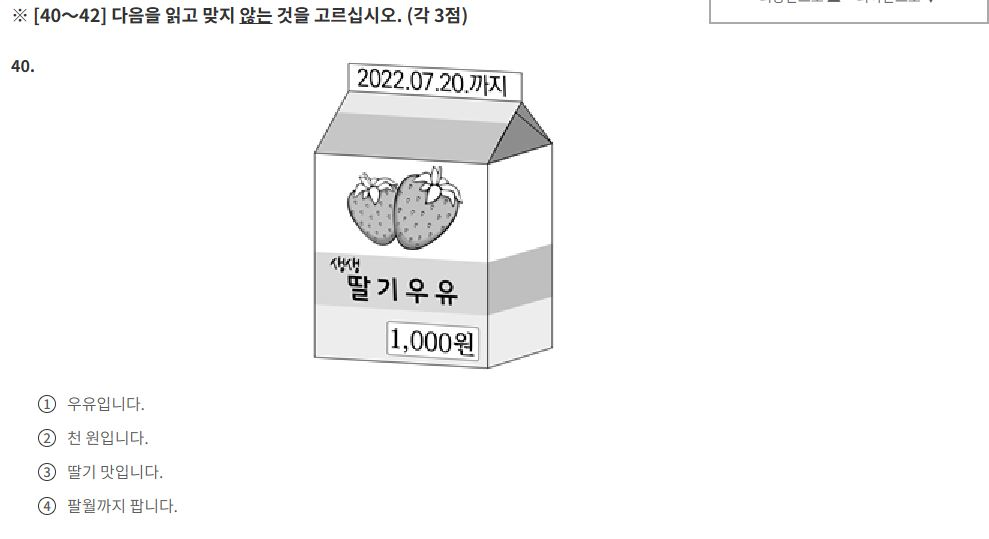
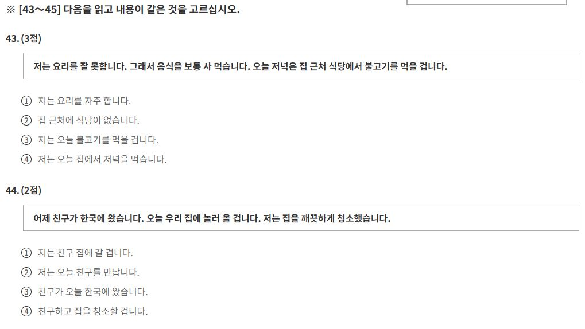
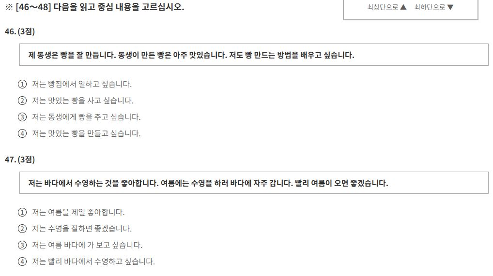
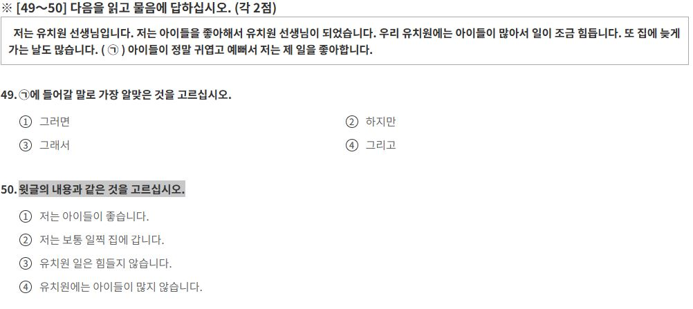
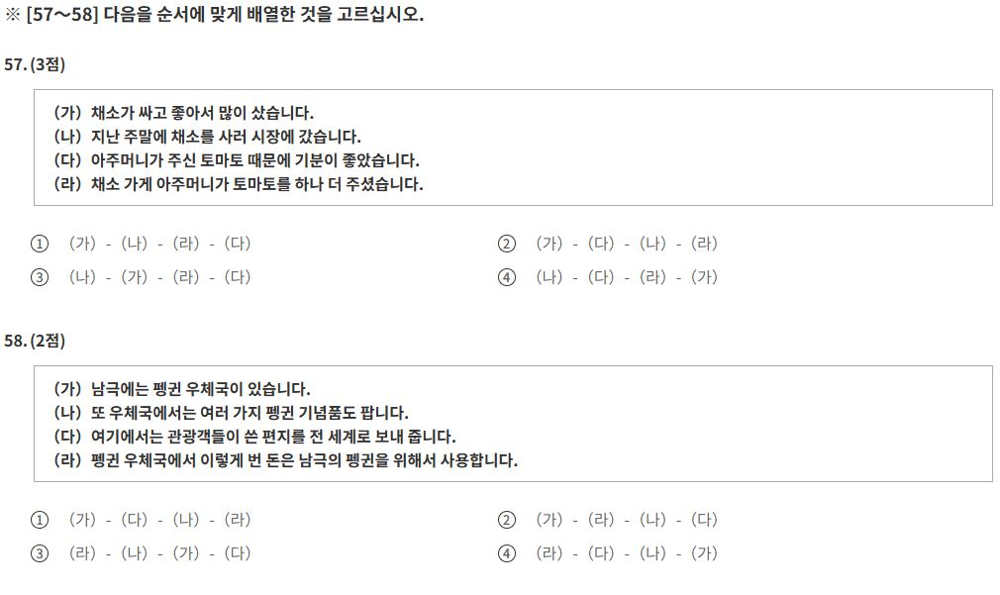
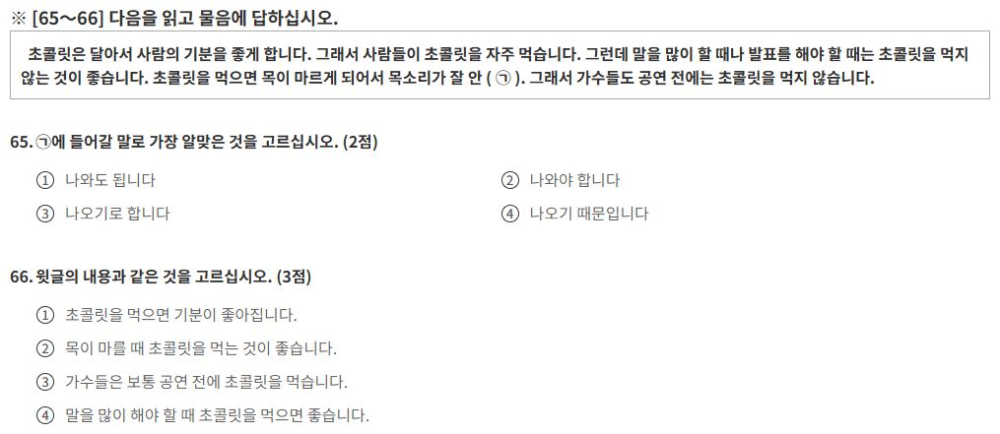

### 한국어 사고력 LLM 벤치마킹 순위

- 한국어 언어모델 사고력 벤치마크 순위 https://lk.instruct.kr/
  


### 테스트 모델 목록

- 대부분 문제당 여유롭게 입+출력 500~2000 토큰 정도 소모된다고 보면 됨.

|Index|이름|비용
|---|---|---|
1|claude-3-opus|입력:$15/백만토큰, 출력:$75/백만토큰
2|gpt-4-turbo|입력:$10/백만토큰, 출력:$30/백만토큰
3|claude-3-sonnet|입력:$3/백만토큰, 출력:$15/백만토큰
4|gpt-3.5-turbo|입력:$0.5/백만토큰, 출력:$1.5/백만토큰
5|claude-3-haiku|입력:$0.25/백만토큰, 출력:$1.25/백만토큰


## 토픽I 읽기
### 31-39 알맞은 것 고르기


```python
from problem_template import Problem_Template
from problem_generator import Problem_Generate_Model
```


```python
#models = ["claude-3-opus", "gpt-4-turbo", "claude-3-sonnet", "gpt-3.5-turbo","claude-3-haiku"]
models = ["gpt-3.5-turbo","claude-3-haiku"]
problem_template = Problem_Template("reading_1", "problem_type_1")
problem_generate_model = Problem_Generate_Model(models, use_cache=True, temperature=0.3)
problem_generate_model.request_models_responses(
    problem_template.get_model_message()
)
responses = problem_generate_model.get_model_responses()
```

    claude-3-haiku-20240307 | 
    좋습니다. 이 예시문제들을 참고하여 다음과 같은 변형 문제를 생성해 보겠습니다.
    
    <문제 1>
    <보기> 봄에는 꽃이 피어납니다. 가을에는 단풍이 아름답습니다.
    <선택지>
    1. 날씨
    2. 계절
    3. 음식
    4. 색깔
    
    <정답> 2. 계절
    
    <문제 2>
    <보기> 저는 의사입니다. 간호사도 있습니다.
    <선택지>
    1. 직업
    2. 취미
    3. 가족
    4. 나이
    
    <정답> 1. 직업
    
    <문제 3>
    <보기> 저는 한국어를 공부합니다. 영어도 공부합니다.
    <선택지>
    1. 학교
    2. 언어
    3. 운동
    4. 음식
    
    <정답> 2. 언어
    
    <문제 4>
    <보기> 오늘은 화창한 날씨입니다. 내일은 비가 올 것 같습니다.
    <선택지>
    1. 날씨
    2. 시간
    3. 장소
    4. 사람
    
    <정답> 1. 날씨
    
    <문제 5>
    <보기> 저는 서울에 삽니다. 부산에도 살고 싶습니다.
    <선택지>
    1. 도시
    2. 나라
    3. 가족
    4. 취미
    
    <정답> 1. 도시
    
    Anthropic Tokens Used: 1050
        Prompt Tokens: 587
        Completion Tokens: 463
    Successful Requests: 1
    Total Cost (USD): $0.00158
    Total Cost (KRW): ₩2.133
    --------------------------------------------------------------------------------------------------
    gpt-3.5-turbo | 
    랜덤 주제 단어: 축구
    
    예시문제 1번: <보기> 친구들과 함께 축구를 즐깁니다. 땀을 흘리며 활기차게 경기를 펼칩니다. <선택지>: 1.운동, 2.요리, 3.음악, 4.공부 <정답> 1.운동
    
    예시문제 2번: <보기> 팀원들과 함께 축구를 하기로 했습니다. 경기를 위해 준비를 시작합니다. <선택지>: 1.여행, 2.운동, 3.독서, 4.봄 <정답> 2.운동
    
    예시문제 3번: <보기> 주말에는 친구들과 함께 축구를 즐깁니다. 즐거운 시간을 보내며 스트레스를 풀어요. <선택지>: 1.운동, 2.요리, 3.공부, 4.영화 <정답> 1.운동
    
    예시문제 4번: <보기> 축구를 좋아하는 친구가 많이 모였습니다. 함께 경기를 즐기며 화합을 이룹니다. <선택지>: 1.요리, 2.운동, 3.음악, 4.공부 <정답> 2.운동
    
    예시문제 5번: <보기> 축구 경기를 보는 것이 취미입니다. 주말마다 경기장을 찾아가 즐거운 시간을 보냅니다. <선택지>: 1.운동, 2.여행, 3.독서, 4.음악 <정답> 1.운동
    
    OpenAI Tokens Used: 1030
        Prompt Tokens: 536
        Completion Tokens: 494
    Successful Requests: 1
    Total Cost (USD): $0.00206
    Total Cost (KRW): ₩2.781
    --------------------------------------------------------------------------------------------------


### 31-39 알맞은 것 고르기



```python
problem_template = Problem_Template("reading_1", "problem_type_2")
problem_generate_model = Problem_Generate_Model(models, use_cache=True, temperature=0.5)
problem_generate_model.request_models_responses(
    problem_template.get_model_message()
)
responses = problem_generate_model.get_model_responses()
```

    gpt-3.5-turbo | 
    1. <보기> 나는 한국어 시험을 ( ). 매우 긴장됩니다. <선택지>: 1.읽습니다, 2.쓰입니다, 3.풉니다, 4.먹습니다 <정답> 2.쓰입니다 
    2. <보기> 친구의 생일 선물을 ( ). 어떤 선물이 좋을까요? <선택지>: 1.닦습니다, 2.고칩니다, 3.준비합니다, 4.건넵니다 <정답> 3.준비합니다
    
    OpenAI Tokens Used: 787
        Prompt Tokens: 626
        Completion Tokens: 161
    Successful Requests: 1
    Total Cost (USD): $0.00157
    Total Cost (KRW): ₩2.1195
    --------------------------------------------------------------------------------------------------
    claude-3-haiku-20240307 | 
    변형 문제 생성:
    
    1. <보기> 오늘 날씨가 좋습니다. 공원에서 ( )을 합니다.
    <선택지> 1. 달리기, 2. 자기, 3. 먹기, 4. 운전하기
    <정답> 1. 달리기
    
    2. <보기> 저는 음악을 ( ). 매우 좋아합니다.
    <선택지> 1. 듣습니다, 2. 만듭니다, 3. 마십니다, 4. 잡니다 
    <정답> 1. 듣습니다
    
    3. <보기> 제 친구는 한국어를 ( )합니다. 매우 유창합니다.
    <선택지> 1. 배웁니다, 2. 팝니다, 3. 읽습니다, 4. 마십니다
    <정답> 1. 배웁니다
    
    4. <보기> 오늘 저녁에 ( )을 먹을 것입니다.
    <선택지> 1. 책, 2. 운동화, 3. 밥, 4. 연필
    <정답> 3. 밥
    
    5. <보기> 저는 내일 ( )에 갈 것입니다.
    <선택지> 1. 학교, 2. 집, 3. 병원, 4. 공원
    <정답> 1. 학교
    
    6. <보기> 저는 아침에 일찍 ( )합니다.
    <선택지> 1. 운전, 2. 쓰기, 3. 일어나기, 4. 먹기
    <정답> 3. 일어나기
    
    Anthropic Tokens Used: 1191
        Prompt Tokens: 695
        Completion Tokens: 496
    Successful Requests: 1
    Total Cost (USD): $0.00179
    Total Cost (KRW): ₩2.4165
    --------------------------------------------------------------------------------------------------


### 43-45 내용이 같은 것 고르기




```python
problem_template = Problem_Template("reading_1", "problem_type_3")
problem_generate_model = Problem_Generate_Model(models, use_cache=True, temperature=0.5)
problem_generate_model.request_models_responses(
    problem_template.get_model_message()
)
responses = problem_generate_model.get_model_responses()
```

    gpt-3.5-turbo | 
    <보기>  요즘 날씨가 매우 더워서 에어컨을 자주 켭니다. 그래서 전기 요금이 많이 나올 것 같습니다.  <선택지>: 1.난방을 자주 켭니다., 2.난방을 별로 안 켭니다., 3.에어컨을 아예 안 켭니다., 4.에어컨을 자주 꺼요. <정답> 4.에어컨을 자주 꺼요.
    
    OpenAI Tokens Used: 617
        Prompt Tokens: 469
        Completion Tokens: 148
    Successful Requests: 1
    Total Cost (USD): $0.00123
    Total Cost (KRW): ₩1.6605
    --------------------------------------------------------------------------------------------------
    claude-3-haiku-20240307 | 
    예시문제 3번:
    <보기> 저는 내일 아침 일찍 일어날 예정입니다. 그리고 운동을 할 계획입니다.
    <선택지>
    1. 저는 내일 늦게 일어날 예정입니다.
    2. 저는 내일 운동을 할 계획입니다.
    3. 저는 내일 아침에 운동을 하지 않을 예정입니다.
    4. 저는 내일 아침에 일찍 일어나지 않을 예정입니다.
    
    <정답> 2. 저는 내일 운동을 할 계획입니다.
    
    예시문제 4번:
    <보기> 오늘 날씨가 매우 좋습니다. 그래서 공원에 가서 산책을 할 계획입니다.
    <선택지>
    1. 오늘 날씨가 좋지 않습니다.
    2. 저는 오늘 집에 있을 예정입니다.
    3. 저는 오늘 공원에 가서 운동할 계획입니다.
    4. 저는 오늘 공원에 가서 산책할 계획입니다.
    
    <정답> 4. 저는 오늘 공원에 가서 산책할 계획입니다.
    
    Anthropic Tokens Used: 918
        Prompt Tokens: 522
        Completion Tokens: 396
    Successful Requests: 1
    Total Cost (USD): $0.00138
    Total Cost (KRW): ₩1.863
    --------------------------------------------------------------------------------------------------


### 46-48 중심 생각 고르기




```python
problem_template = Problem_Template("reading_1", "problem_type_4")
problem_generate_model = Problem_Generate_Model(models, use_cache=True, temperature=0.5)
problem_generate_model.request_models_responses(
    problem_template.get_model_message()
)
responses = problem_generate_model.get_model_responses()

```

    gpt-3.5-turbo | 
    예시문제 3번 : <보기> 요즘 친구들과 함께 자주 영화를 보러 다니고 있습니다. 영화를 보는 것이 너무 즐겁습니다. 다음에는 어떤 영화를 볼지 고민 중입니다. <선택지>: 1.저는 영화를 만들고 싶습니다., 2.저는 친구들과 함께 영화를 만들고 싶습니다., 3.저는 영화 속 이야기가 너무 좋아요., 4.저는 다음에는 어떤 영화를 볼지 고민 중입니다. 
    
    OpenAI Tokens Used: 674
        Prompt Tokens: 491
        Completion Tokens: 183
    Successful Requests: 1
    Total Cost (USD): $0.00135
    Total Cost (KRW): ₩1.8225
    --------------------------------------------------------------------------------------------------
    claude-3-haiku-20240307 | 
    예시문제 3번:
    <보기>
    저는 친구들과 함께 공원에서 운동하는 것을 좋아합니다. 공원에는 운동할 수 있는 시설들이 많아서 재미있게 운동할 수 있습니다. 친구들과 함께 운동하면 더 즐겁습니다.
    
    <선택지>
    1. 저는 혼자서도 운동하고 싶습니다.
    2. 저는 공원에 가서 운동하고 싶습니다.
    3. 저는 친구들과 함께 운동하고 싶습니다.
    4. 저는 운동 시설이 많은 곳에서 운동하고 싶습니다.
    
    <정답>
    3. 저는 친구들과 함께 운동하고 싶습니다.
    
    예시문제 4번:
    <보기>
    저는 새로운 요리를 배우는 것을 좋아합니다. 최근에는 친구가 추천해준 파스타 요리를 만들어 보았습니다. 그 요리는 정말 맛있었습니다.
    
    <선택지>
    1. 저는 파스타 요리를 만들고 싶습니다.
    2. 저는 새로운 요리를 배우고 싶습니다.
    3. 저는 친구에게 새로운 요리를 추천받고 싶습니다.
    4. 저는 맛있는 요리를 먹고 싶습니다.
    
    <정답>
    2. 저는 새로운 요리를 배우고 싶습니다.
    
    Anthropic Tokens Used: 1068
        Prompt Tokens: 576
        Completion Tokens: 492
    Successful Requests: 1
    Total Cost (USD): $0.0016
    Total Cost (KRW): ₩2.16
    --------------------------------------------------------------------------------------------------


### 49-56 빈칸에 들어갈 말 + 같은 것 고르기




```python
models = ["gpt-3.5-turbo","claude-3-haiku"]
problem_template = Problem_Template("reading_1", "problem_type_5")
problem_generate_model = Problem_Generate_Model(models, use_cache=True, temperature=0.5)
problem_generate_model.request_models_responses(
    problem_template.get_model_message()
)
responses = problem_generate_model.get_model_responses()
```

    gpt-3.5-turbo | 
    <보기> 요즘 한국은 날씨가 매우 더워서 에어컨을 자주 틀어야 합니다. 그래서 전기 요금이 많이 올랐어요. <질문 1> ()에 들어갈 말로 가장 알맞은 것을 고르십시오. <선택지>: 1.하지만, 2.그러면, 3.그리고, 4.그래서 <질문 2> <보기>의 내용과 같은 것을 고르십시오. <선택지>: 1.한국은 요즘 날씨가 매우 춥습니다., 2.에어컨을 틀지 않으면 덥습니다., 3.전기 요금이 싸졌어요., 4.날씨가 추워서 에어컨을 안 틀어도 돼요.
    
    OpenAI Tokens Used: 732
        Prompt Tokens: 483
        Completion Tokens: 249
    Successful Requests: 1
    Total Cost (USD): $0.00146
    Total Cost (KRW): ₩1.971
    --------------------------------------------------------------------------------------------------
    claude-3-haiku-20240307 | 
    [새로운 문제 1번 : <보기> 저는 회사 직원입니다. 저는 회사 업무를 좋아해서 열심히 일합니다. 우리 회사에는 직원이 많아서 일이 조금 힘듭니다. 또 퇴근 시간이 늦은 날도 많습니다. ( ) 회사 일이 정말 재미있어서 저는 제 일을 좋아합니다. <질문 1> ( ) 에 들어갈 말로 가장 알맞은 것을 고르십시오. <선택지>: 1.그러면, 2.하지만, 3.그래서, 4.그리고 <정답> 2.하지만
    <질문 2> <보기>의 내용과 같은 것을 고르십시오. <선택지>: 1.저는 회사 일이 좋습니다., 2.저는 보통 일찍 퇴근합니다., 3.회사 일은 힘들지 않습니다., 4.우리 회사에는 직원이 많지 않습니다. <정답> 1.저는 회사 일이 좋습니다.
    
    [새로운 문제 2번 : <보기> 저는 대학생입니다. 저는 공부를 열심히 해서 성적이 좋습니다. 우리 학교에는 학생이 많아서 도서관이 항상 붐빕니다. 또 시험 기간에는 밤늦게까지 공부하는 날이 많습니다. ( ) 공부가 재미있어서 저는 열심히 하고 있습니다. <질문 1> ( ) 에 들어갈 말로 가장 알맞은 것을 고르십시오. <선택지>: 1.그러면, 2.하지만, 3.그래서, 4.그리고 <정답> 4.그리고
    <질문 2> <보기>의 내용과 같은 것을 고르십시오. <선택지>: 1.저는 공부가 좋습니다., 2.저는 보통 일찍 집에 갑니다., 3.우리 학교 도서관은 항상 한산합니다., 4.우리 학교에는 학생이 많지 않습니다. <정답> 1.저는 공부가 좋습니다.]
    
    Anthropic Tokens Used: 1272
        Prompt Tokens: 546
        Completion Tokens: 726
    Successful Requests: 1
    Total Cost (USD): $0.00191
    Total Cost (KRW): ₩2.5785
    --------------------------------------------------------------------------------------------------


### 57-58 순서 나열




```python
models = ["gpt-3.5-turbo","claude-3-haiku"]
problem_template = Problem_Template("reading_1", "problem_type_6")
problem_generate_model = Problem_Generate_Model(models, use_cache=True, temperature=1)
problem_generate_model.request_models_responses(
    problem_template.get_model_message()
)
responses = problem_generate_model.get_model_responses()
```

    claude-3-haiku-20240307 | 
    다음과 같은 문제를 생성해 보았습니다.
    
    [문제]
    <보기>
    (가) 김 선생님께서 우리 반 학생들에게 책을 선물해 주셨습니다.
    (나) 교과서 외에도 재미있는 동화책들이 많이 있었습니다. 
    (다) 책을 읽으면서 즐거운 시간을 보냈습니다.
    (라) 우리 반 학생들은 책을 열심히 읽었습니다.
    
    <선택지>
    1. (나) - (가) - (라) - (다)
    2. (라) - (다) - (가) - (나) 
    3. (가) - (나) - (다) - (라)
    4. (다) - (라) - (나) - (가)
    
    <정답> 3. (가) - (나) - (다) - (라)
    
    Anthropic Tokens Used: 981
        Prompt Tokens: 713
        Completion Tokens: 268
    Successful Requests: 1
    Total Cost (USD): $0.00147
    Total Cost (KRW): ₩1.9845
    --------------------------------------------------------------------------------------------------
    gpt-3.5-turbo | 
    [새로운 문제 1번]
    <보기> (가) 오늘은 친구들과 영화를 보러 영화관에 갔어요. (나) 영화관에서는 맛있는 팝콘과 음료수를 팔고 있습니다. (다) 영화가 시작되기 전에 몇몇 친구들이 늦게 도착했습니다. (라) 영화를 보면서 모두 즐거운 시간을 보냈습니다.
    <선택지> 1. (가)-(나)-(다)-(라), 2. (나)-(다)-(라)-(가), 3. (다)-(라)-(가)-(나), 4. (라)-(나)-(가)-(다)
    <정답> 1. (가)-(나)-(다)-(라)
    
    [새로운 문제 2번]
    <보기> (가) 여름방학 때는 수영장에 자주 가요. (나) 수영장에서는 시원한 수영을 하고 아이스크림도 먹습니다. (다) 물놀이를 즐긴 뒤에는 미끄럼틀에서 놀기도 해요. (라) 수영장에서 친구들을 만나서 신나게 놀았어요.
    <선택지> 1. (나)-(다)-(가)-(라), 2. (라)-(가)-(나)-(다), 3. (가)-(나)-(라)-(다), 4. (다)-(가)-(라)-(나)
    <정답> 3. (가)-(나)-(라)-(다)
    
    OpenAI Tokens Used: 1079
        Prompt Tokens: 669
        Completion Tokens: 410
    Successful Requests: 1
    Total Cost (USD): $0.00216
    Total Cost (KRW): ₩2.916
    --------------------------------------------------------------------------------------------------


### 59-70 빈칸에 들어갈 말 + 같은 것 고르기




```python
models = ["gpt-3.5-turbo","claude-3-haiku"]
problem_template = Problem_Template("reading_1", "problem_type_7")
problem_generate_model = Problem_Generate_Model(models, use_cache=True, temperature=1)
problem_generate_model.request_models_responses(
    problem_template.get_model_message()
)
responses = problem_generate_model.get_model_responses()
```

    gpt-3.5-turbo | 
    <보기> 과일을 많이 먹으면 건강에 좋습니다. 그래서 사람들이 과일을 자주 먹습니다. 그런데 속이 안 좋을 때나 배가 아플 때는 과일을 많이 먹는 것이 좋지 않습니다. 과일을 많이 먹으면 속이 부풀어서 속이 안 (㉠). 그래서 속이 안 좋을 때는 과일을 적게 먹어야 합니다. 
    <질문 1> ㉠ 에 들어갈 말로 가장 알맞은 것을 고르십시오.
    <선택지>: 1. 편합니다, 2. 늘어납니다, 3. 좋습니다, 4. 날아갑니다
    <질문 2> <보기>의 내용과 같은 것을 고르십시오.
    <선택지>: 1. 과일을 많이 먹으면 건강에 좋습니다., 2. 과일은 속이 안 좋을 때 먹으면 좋습니다., 3. 과일을 적게 먹으면 배가 아프지 않습니다., 4. 과일을 많이 먹는 것이 항상 좋습니다.
    
    OpenAI Tokens Used: 965
        Prompt Tokens: 621
        Completion Tokens: 344
    Successful Requests: 1
    Total Cost (USD): $0.00193
    Total Cost (KRW): ₩2.6055
    --------------------------------------------------------------------------------------------------
    claude-3-haiku-20240307 | 
    [신문 기사 읽기]
    <보기>
    여름이 다가오면 많은 사람들이 수박을 먹습니다. 수박은 시원하고 달아서 여름철에 잘 어울리는 과일입니다. 그런데 수박을 너무 많이 먹으면 배가 아프거나 설사를 하게 됩니다. 또한 수박을 먹기 전에는 김치 등의 자극적인 음식을 먹지 않는 것이 좋습니다. 자극적인 음식을 먹은 후에 수박을 먹으면 건강에 좋지 않습니다.
    
    <문제 1> 수박을 너무 많이 먹으면 ( )하게 된다.
    ① 기분이 좋아진다
    ② 피로가 풀린다
    ③ 배가 아프거나 설사를 한다
    ④ 몸무게가 늘어난다
    
    <문제 2> <보기>의 내용과 같은 것을 고르시오.
    ① 수박은 시원하고 달아서 여름에 잘 어울린다.
    ② 수박을 먹기 전에는 김치 등의 다른 음식을 먹어도 된다.
    ③ 수박을 너무 많이 먹으면 기분이 좋아진다.
    ④ 수박을 먹으면 피로가 풀린다.
    
    <정답>
    <문제 1> ③ 배가 아프거나 설사를 한다
    <문제 2> ① 수박은 시원하고 달아서 여름에 잘 어울린다.
    
    Anthropic Tokens Used: 1211
        Prompt Tokens: 710
        Completion Tokens: 501
    Successful Requests: 1
    Total Cost (USD): $0.00182
    Total Cost (KRW): ₩2.457
    --------------------------------------------------------------------------------------------------


```python

```
